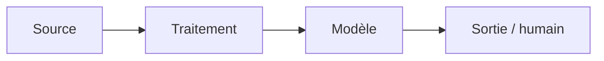

# Fiche de décision — <votre cas> (À COMPLÉTER)

**Client :** <nom, rôle> · **Groupe :** <prénoms> · **Cas <A/C/D>**

> **Livrable principal — 3-4 pages au maximum** (un plafond, pas une cible).
> Lisible par un architecte technique. Renommez en `dossier_conception.md`.
> Tout s'écrit **ici, une seule fois** : décisions, arbitrages, schéma et
> questions prévues. Tableaux plutôt que paragraphes.

---

## 1. Décisions de groupe (mardi 15h30-16h45)

> 3-5 points où vos cadrages M8-B1 divergeaient. Pas de compromis mou : un
> choix tranché et argumenté.

| Divergence | Positions (qui pensait quoi) | Décision retenue | Pourquoi |
| --- | --- | --- | --- |
|  |  |  |  |

## 2. Les 5 arbitrages

> Pour chacun : **choix + raisons (≥ 1 chiffrée) + condition de changement
> d'avis** — ou « non applicable » en une ligne justifiée (+ ce qui ferait se
> poser la question). Répondre « SLM » ou « RAG » sur un cas sans texte pour
> remplir la grille est un signal de tropisme.

| Arbitrage | Choix — ou « non applicable » | Raisons (≥ 1 chiffrée) | On changerait d'avis si… |
| --- | --- | --- | --- |
| ML classique vs deep learning |  |  |  |
| SLM vs LLM |  |  |  |
| RAG oui / non |  |  |  |
| Agents oui / non |  |  |  |
| Zero-shot suffit ? |  |  |  |

## 3. Architecture finale et sobriété



<!-- Chaque brique découle d'un arbitrage. Commentez en 3-4 lignes. -->

**Ce qu'on n'a PAS mis (obligatoire)** : <!-- brique écartée + raison, ex. « pas de vector DB : RAG = non » -->

## 4. Évaluation

<!-- Comment on saura que ça marche AVANT la mise en service :
     baseline simple à battre, découpage des données (temporel si le temps compte),
     métriques alignées sur le KPI métier du cadrage. -->

## 5. Déploiement et monitoring (héritage M5 / M6)

<!-- Où et comment ça tourne, rollback. Puis : -->

| Question | Métrique | Seuil | Alerte vers |
| --- | --- | --- | --- |
| En vie ? |  |  |  |
| Prédit bien ? |  |  |  |
| Données qui dérivent ? |  |  |  |

<!-- Quand réentraîner, et qui décide. -->

## 6. Conformité et sécurité

<!-- Qualification AI Act et base légale RGPD reprises des cadrages (raisonnement,
     pas étiquette), en tenant compte de l'imprévu client de mardi 14h30.
     Chaque menace de sécurité retenue → sa réponse d'architecture + le risque résiduel. -->

## 7. Coûts (ordres de grandeur, sur VOTRE volumétrie)

<!-- ressources/fiche_chiffrage.md — à recalculer, pas à recopier. -->

| Poste | Estimation | Hypothèse |
| --- | --- | --- |
|  |  |  |

---

## ⭐ Optionnel — Pseudo-code du composant critique

```text
fonction <nom>(<entrées>):
    # 10-20 lignes : cas nominal, cas limite (donnée manquante, confiance basse…),
    # ce qui est journalisé.
```

## Annexe — 5 questions prévues (hors pagination)

| # | Question probable | Réponse préparée (2-3 lignes) | Qui répond |
| --- | --- | --- | --- |
| 1 |  |  |  |
| 2 |  |  |  |
| 3 |  |  |  |
| 4 |  |  |  |
| 5 |  |  |  |
